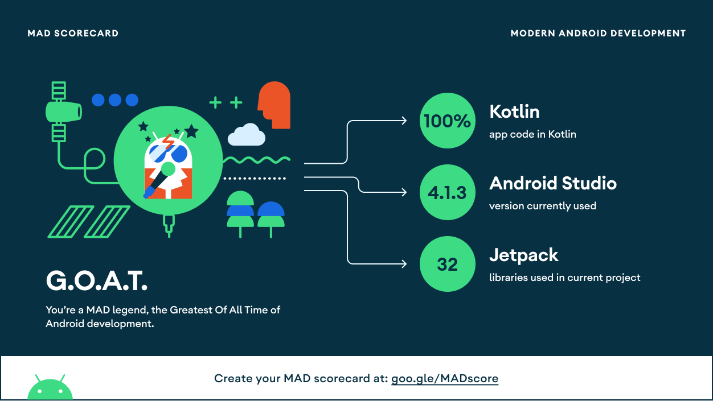
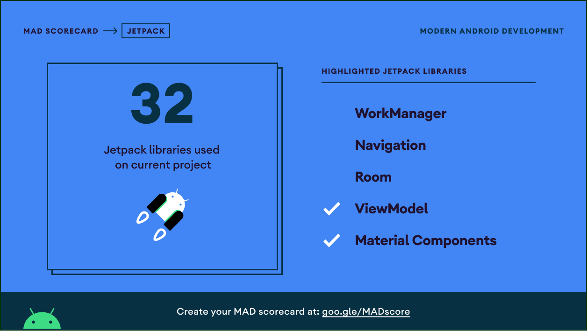
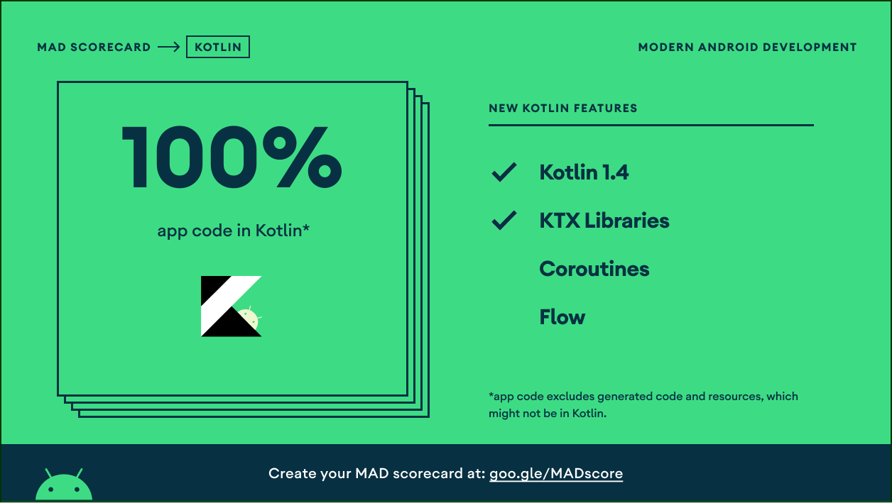

# StackoverflowQuestions
## Features
Currently the following features are implemented: 

- MVVM Design Pattern  
- Dependency Injection with dagger2  
- RxJava  
- Unit test  
- Android Architecture components  

## MAD SCORECARD

